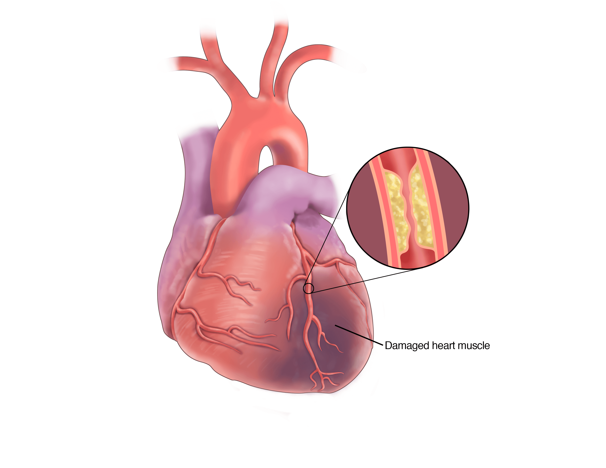

 
  

<h1 align="center"> Cardiovascular Risk Prediction </h1>

## Abstract:

Healthcare is an inevitable task to be done in human life. Cardiovascular disease is a broad category for a range of diseases that are affecting heart and blood vessels. The early methods of forecasting cardiovascular diseases helped in making decisions about the changes to have occurred in high-risk patients which resulted in the reduction of their risks. The healthcare industry contains lots of medical data, therefore machine learning algorithms are required to make decisions effectively in the prediction of heart diseases.

## Problem Statement:

The dataset is from an ongoing cardiovascular study on residents of the town of Framingham, Massachusetts. The classification goal is to predict whether the patient has a 10-year risk of future coronary heart disease (CHD). The dataset provides the patients’ information. It includes over 4,000 records and 15 attributes. Each attribute is a potential risk factor. There are demographic, behavioural, and medical risk factors.
